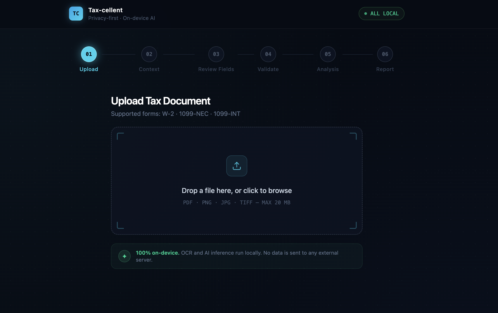

# Tax-cellent

**Tax document review for international students and workers in the US.**

Upload a W-2, answer a few immigration questions, and receive a step-by-step federal tax calculation with IRS rule citations and plain-English explanations — with automatic FICA exemption detection for F-1 and J-1 visa holders.

Tax math is deterministic Python. AI adds explanations only — it never touches the numbers.

---

## How It Works

```
PDF / Image
    │
    ▼
┌─────────────────┐    ┌──────────────────┐    ┌─────────────────────┐
│  OCR Engine     │───▶│  Human Review UI │───▶│  Tax Engine (Python)│
│  (local)        │    │  (verify fields) │    │  deterministic math │
└─────────────────┘    └──────────────────┘    └──────────┬──────────┘
                                                          │ numbers only
                                                          ▼
                                              ┌─────────────────────┐
                                              │  LLM Explainer      │
                                              │  (plain English)    │
                                              │  local or cloud     │
                                              └──────────┬──────────┘
                                                          │
                                                          ▼
                                              ┌─────────────────────┐
                                              │  Calculation Ledger │
                                              │  + FICA Handoff Card│
                                              └─────────────────────┘
```

**Architecture principle:** The tax engine computes all arithmetic using 2025 IRS constants. The LLM is only permitted to produce plain-English explanations — it receives numbers and rules as input, and is explicitly forbidden from recalculating or producing dollar figures. If the LLM is unavailable, the ledger renders with correct numbers and IRS-rule citations as fallback text.

---

## Features

- **Privacy-first, local by default** — runs entirely on your machine via Ollama. No document data leaves your device unless you opt in to a cloud AI provider for explanations.
- **Optional cloud AI** — choose OpenAI (GPT-4o), Anthropic (Claude), or Google (Gemini) for higher-quality explanations. Your API key is used session-only and never stored.
- **Calculation Ledger** — step-by-step table (Gross Wages → Standard Deduction → Taxable Income → Federal Tax → Balance) with expandable inline explanations and IRS rule citations.
- **FICA Refund Detection** — automatically flags Social Security and Medicare taxes incorrectly withheld from F-1/J-1 students (IRC §3121(b)(19)), with Form 843 filing guidance.
- **Human-in-the-loop verification** — every extracted field is presented for review and editing before any calculation runs. You confirm the numbers; the engine computes.
- **Resilient by design** — if the AI provider is unavailable or returns an error, the ledger renders with deterministic template text. The numbers are always correct.
- **2025 IRS constants** — brackets, standard deduction ($14,600), FICA rates and wage caps sourced from Rev. Proc. 2024-40.

---

## Example Scenario

The following inputs exercise FICA detection — the most common refund opportunity for international students:

| Field                            | Value   |
| -------------------------------- | ------- |
| Form type                        | W-2     |
| Box 1 — Wages                    | $52,000 |
| Box 2 — Federal withheld         | $8,000  |
| Box 4 — Social Security withheld | $3,224  |
| Box 6 — Medicare withheld        | $754    |
| Visa type                        | F-1     |
| First US entry year              | 2024    |

**Expected output:** $3,750.50 estimated federal refund + amber FICA Handoff Card citing IRC §3121(b)(19) and Form 843.

---

## Tech Stack

| Layer              | Technology                                        |
| ------------------ | ------------------------------------------------- |
| Frontend           | Next.js 16, React 19, TypeScript, Tailwind CSS v4 |
| Backend            | FastAPI, Python 3.10+, Pydantic v2                |
| OCR                | pdfplumber + opendataloader-pdf                   |
| Local AI           | Ollama (`qwen3:8b` default)                       |
| Cloud AI (optional)| OpenAI, Anthropic, Google Gemini                  |
| Containerization   | Podman / Docker Compose                           |

---

## Getting Started

### Prerequisites

- **Python 3.10+**
- **Node.js 18+**
- **Ollama** (for local AI) — [install](https://ollama.com), then:

```bash
ollama pull qwen3:8b
ollama pull deepseek-ocr
```

### Quick Start

```bash
git clone https://github.com/Jiahui-Zhou98/Tax-cellent.git
cd Tax-cellent

# Start Ollama in a separate terminal
ollama serve

# Start backend + frontend
./start_dev.sh
```

### Manual Setup

**Backend:**

```bash
cd backend
python -m venv .venv
source .venv/bin/activate       # Windows: .venv\Scripts\activate
pip install -r requirements.txt
cp .env.example .env            # then edit .env as needed
uvicorn app.main:app --reload --port 8000
```

**Frontend:**

```bash
cd frontend
npm install
NEXT_PUBLIC_API_URL=http://localhost:8000 npm run dev
```

---

## Configuration

Copy `backend/.env.example` to `backend/.env` and edit as needed:

```env
# Local AI (Ollama)
OLLAMA_BASE_URL=http://localhost:11434
MODEL_A=qwen3:8b
OCR_MODEL=deepseek-ocr

# Cloud AI (optional — leave blank to require users to paste their own key)
OPENAI_API_KEY=
ANTHROPIC_API_KEY=
GEMINI_API_KEY=

# Storage
UPLOAD_DIR=/tmp/taxdebate_uploads
SESSION_DIR=/tmp/taxdebate_sessions
MAX_FILE_SIZE_MB=20
```

**Cloud AI keys:** When set in `.env`, users of that provider do not need to paste a key — the backend uses the configured key. Users can always paste their own key to override. Keys pasted in the browser are used for that session only and never written to disk.

---

## Container Deploy (Podman / Docker)

Pre-built images are published to [GitHub Container Registry](https://github.com/Jiahui-Zhou98/Tax-cellent/pkgs/container/) on every push to `main`.

### Option A — Pre-built images (recommended)

```bash
# 1. Start Ollama
ollama serve && ollama pull qwen3:8b && ollama pull deepseek-ocr

# 2. Download the production compose file
curl -O https://raw.githubusercontent.com/Jiahui-Zhou98/Tax-cellent/main/podman-compose.prod.yml

# 3. Start
podman-compose -f podman-compose.prod.yml up
# or: docker compose -f podman-compose.prod.yml up
```

### Option B — Build from source

```bash
git clone https://github.com/Jiahui-Zhou98/Tax-cellent.git
cd Tax-cellent
ollama serve   # in a separate terminal
podman-compose up --build
```

> **Docker on Linux:** You may need `--add-host=host.containers.internal:host-gateway` or `OLLAMA_BASE_URL=http://host.docker.internal:11434`.

---

## Screenshots



| Step               | Screen                                                                         |
| ------------------ | ------------------------------------------------------------------------------ |
| 01 — Upload        | Drag-and-drop zone for PDF and image files                                     |
| 02 — Context       | Immigration questionnaire (visa type, entry date, days present)                |
| 03 — Review Fields | Field editor with confidence scores and inline editing                         |
| 04 — Validation    | Rule-based checks with severity badges (PASS / WARN / FAIL)                    |
| 05 — AI Settings   | Provider picker (Ollama / OpenAI / Anthropic / Gemini) with health status      |
| 06 — Analysis      | Progress indicator with rotating IRS-rule hints                                |
| 07 — Report        | Calculation Ledger with expandable rows, outcome banner, and FICA Handoff Card |

---

## Privacy

**Local mode (default):** All OCR and AI inference run via Ollama on your machine. No document content is sent to any external server.

**Cloud AI mode (optional):** When a user selects OpenAI, Anthropic, or Gemini, the list of calculation steps (labels, rule references, and computed values — not the raw document) is sent to that provider's API to generate plain-English explanations. Raw document content and personal information from the original file are never forwarded to cloud providers.

- Uploaded files are written to `/tmp/taxdebate_uploads` and session state to `/tmp/taxdebate_sessions`, cleared on reboot by default.
- API keys pasted in the browser are used for that session only and never written to disk or logs.
- The AI explainer prompt explicitly forbids the model from recalculating numbers or producing dollar amounts.

---

## Current Scope & Limitations

Tax-cellent is under active development. The current version handles the most common filing scenario for international students: **federal income tax for single filers with W-2 income**.

Known limitations:
- Filing statuses other than single (MFJ, HOH, QSS) are not yet supported.
- 1099-NEC and 1099-INT are OCR-extracted but do not yet have deterministic calculation paths.
- State tax calculation is not implemented.
- AI-generated explanations are best-effort; always verify with a qualified tax professional.

**These calculations and explanations are for informational purposes only and do not constitute tax, legal, or financial advice. Always consult a qualified tax professional before filing.**

---

## Roadmap

- **IRS regulation-backed engine** — replace hardcoded constants with a structured rule system tied to Rev. Proc. and IRC sections, enabling systematic annual updates.
- **Additional filing statuses** — MFJ, HOH, and qualifying surviving spouse paths.
- **Expanded form support** — deterministic calculation paths for 1099-NEC (Schedule SE), 1099-INT, and Schedule B.
- **State tax estimation** — brackets and rules for the highest-volume states (CA, NY, TX, WA, IL).
- **Tax treaty support** — automatic treaty benefit detection for students from treaty countries.
- **Multi-document sessions** — combine W-2 + 1099 sources in a single tax year calculation.
